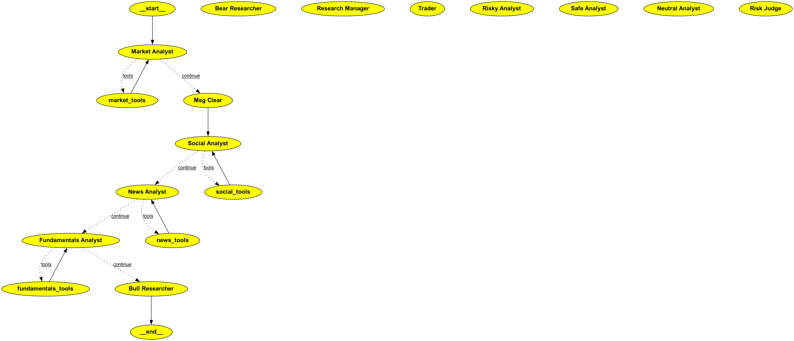

# Agentic trading

Let us use the power of LLM to analyze stocks and provide suggestions
A Deep Thinking Trading system has many departments, each made up of sub-agents that use logical flows to make smart decisions. For example, an Analyst team gathers data from diverse sources, a Researcher team debates and analyzes this data to form a strategy, and the Execution team refines and approves the trade while working alongside portfolio management, other supporting sub-agents, and more.
There is a lot that happens under the hood, a typical flow works like this …

_Agentic Trading System (Created by [Sumanth Dhanya](https://www.linkedin.com/in/sumanth-dhanya/))_

## Workflow Execution Graph

The following LangGraph visualization shows the execution flow of our trading agents, highlighting how each agent interacts within the system:

_LangGraph execution flow showing agent interactions and decision points (Created by [Sumanth Dhanya](https://www.linkedin.com/in/sumanth-dhanya/))_

1. **First, a team of specialized Analyst agents conducts comprehensive market intelligence gathering**, collecting a 360-degree view including technical indicators, news coverage, social media sentiment, and company fundamentals.
2. **Next, Bull and Bear agents engage in adversarial debate** to rigorously stress-test the findings, which a Research Manager synthesizes into a cohesive, balanced investment strategy.
3. **A specialized Trader agent then transforms this strategy into a concrete, executable proposal**, which undergoes immediate scrutiny from a multi-perspective Risk Management team (representing Risky, Conservative, and Balanced viewpoints).
4. **The Portfolio Manager agent makes the final, binding decision**, carefully weighing the Trader's proposal against the risk assessment debate before issuing final approval.
5. **Upon approval, the system extracts a clean, machine-readable signal** (BUY, SELL, or HOLD) from the manager's natural language decision, optimized for seamless execution and comprehensive auditing.
6. **The process completes with an integrated feedback loop**, where agents systematically reflect on trade outcomes to generate actionable insights, which are stored in long-term memory to continuously enhance future decision-making performance.

## Features

* TODO
- make it compatible with cli ticker run
- increase test coverage
